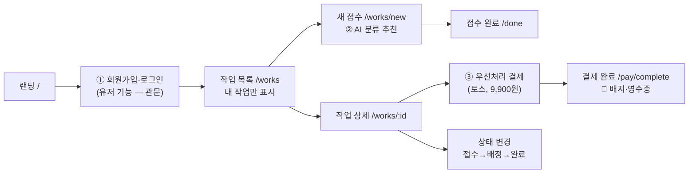
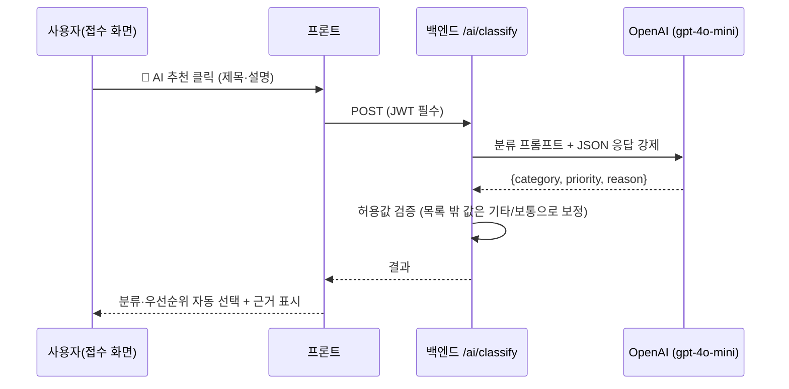
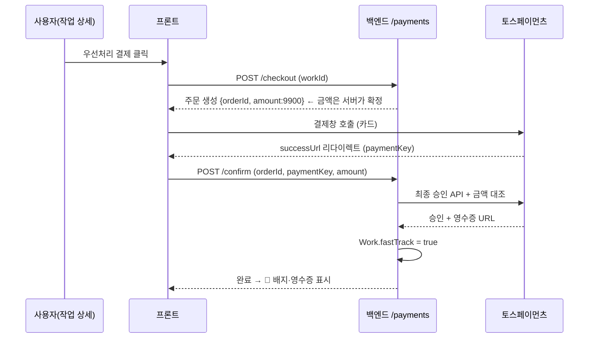

# 고도화 기능 설계 및 흐름 정의 — 스프린트 미션 8

빌딩 시설 민원 MVP(BFS OS)에 붙인 고도화 기능 3종(유저·OpenAI·결제)이
**기존 흐름의 어디에 위치하고, 사용자가 언제·무엇을 입력해·무엇을 얻는지** 정의합니다.

## 0. 전체 서비스 흐름에서의 위치

세 기능 모두 별도 화면을 새로 만들지 않고, 기존 MVP 흐름(접수 → 목록 → 상세 → 완료)의
관문·중간·후반에 끼워 넣었습니다. 기존 사용자 동선은 그대로입니다.

- **① 유저 기능**: 흐름의 **관문**. 기존의 가짜 로그인(localStorage) 자리를 실인증으로 교체
- **② OpenAI 분류**: 흐름의 **중간**. 접수 폼 안의 분류·우선순위 필드를 보조
- **③ 결제**: 흐름의 **후반**. 접수된 작업의 상세 화면에서 선택적으로 사용

---

## 1. 유저 기능 — 회원가입 / 로그인 (JWT)

**기존 흐름 속 위치**: `/login` 라우트 가드. 미션 6의 "이름만 넣으면 통과"하던
시뮬레이션을 실제 인증으로 교체 — 라우트 구조는 그대로, 인증의 실체만 바뀜.

| 사용자 기준 | 정의 |
|---|---|
| **언제 사용하는가** | 첫 방문 시(회원가입), 재방문·토큰 만료 시(로그인) |
| **어떤 입력을 하는가** | 가입: 이름·이메일·비밀번호(8자↑) / 로그인: 이메일·비밀번호 |
| **어떤 결과를 얻는가** | JWT(7일) 발급 → **내가 접수한 작업만** 보이는 목록. 기기를 바꿔도 같은 데이터 |

**기존 MVP와 연결된 시나리오**
> 관리소장 김소장이 사무실 PC에서 가입하고 민원 3건을 접수한다.
> 다음 날 현장에서 폰으로 로그인하면 같은 3건이 보인다.
> 다른 계정으로 로그인한 동료에게는 김소장의 민원이 보이지 않는다(서버 소유권 검증, 타인 작업은 404).

**실패 흐름**: 틀린 비밀번호 → 401 + "이메일 또는 비밀번호가 올바르지 않습니다" /
토큰 만료 → 세션 정리 후 로그인 화면으로 안내.

---

## 2. OpenAI API — 민원 자동 분류

**기존 흐름 속 위치**: 접수 화면(`/works/new`)의 분류·우선순위 필드 **바로 위**.
접수 흐름에 단계를 추가하지 않고, 기존 입력을 도와주는 보조 버튼으로 존재.

| 사용자 기준 | 정의 |
|---|---|
| **언제 사용하는가** | 민원 제목을 쓴 뒤, 이게 전기 문제인지 배관 문제인지·긴급인지 판단이 어려울 때 |
| **어떤 입력을 하는가** | 이미 쓰던 제목(5자↑)·상세 설명 그대로 — 추가 입력 없이 버튼 1번 |
| **어떤 결과를 얻는가** | 분류(전기/배관/냉난방/미화/기타)·우선순위(보통/긴급)가 **자동 선택**되고 한 줄 근거 표시. 제안일 뿐이라 언제든 수동 수정 가능 |

**처리 흐름**

**실패 흐름**: API 키 미설정 → 503 + "직접 분류를 선택해 주세요"(수동 입력 폴백) /
OpenAI 오류 → 502 + 재시도 안내. **AI가 죽어도 접수는 항상 가능** — 보조 기능이 본 흐름을 막지 않는 원칙.

**실측 예시**: "지하 주차장 배수구 역류로 물이 차오름" → 배관/누수·🚨긴급
("안전 위험이 발생하고 있습니다") / "복도 형광등 깜빡임" → 전기·보통.

---

## 3. 결제 기능 — 우선처리(Fast-track), 토스페이먼츠

**기존 흐름 속 위치**: 작업 상세(`/works/:id`) 상단 카드. 접수라는 본 흐름이 **끝난 뒤**
선택하는 부가 기능이라, 결제를 안 해도 기존 흐름은 완전히 동일하게 동작.

| 사용자 기준 | 정의 |
|---|---|
| **언제 사용하는가** | 접수한 민원이 정말 급해서 대기열 앞으로 보내고 싶을 때 |
| **어떤 입력을 하는가** | "🚀 우선처리로 올리기(9,900원)" 클릭 → 토스 결제창에서 카드 정보 |
| **어떤 결과를 얻는가** | 결제 완료 화면 + 영수증 링크, 작업에 🚀 배지 — 배정 대기열 최상단 표시 대상 |

**처리 흐름**

**실패 흐름**: 결제창 닫음 → 안내 후 원래 화면 복귀(주문은 pending으로 재사용) /
승인 실패 → failed 기록 + 사유 표시 / **금액 위·변조 → 400 차단**(서버 확정 금액과 대조) /
이미 결제된 작업 재결제 → 409. 현재 토스 테스트 키라 전 구간이 실플로우로 돌되 실청구는 없음.

---

## 4. 데이터 설계 (요약)

| 테이블 | 핵심 필드 | 역할 |
|---|---|---|
| `User` | email(unique), password(bcrypt) | ① 인증 주체 |
| `Work` | title, category, priority, status, **fastTrack**, userId | 민원 — 소유권·우선처리 상태 |
| `Payment` | orderId(unique), amount, status(pending/paid/failed), paymentKey, receiptUrl, workId | ③ 결제 원장 — 금액·승인 기록 |

모든 비밀 값(JWT 시크릿·OpenAI 키·토스 시크릿)은 서버 환경 변수로만 관리하며,
클라이언트에는 노출되지 않습니다.
